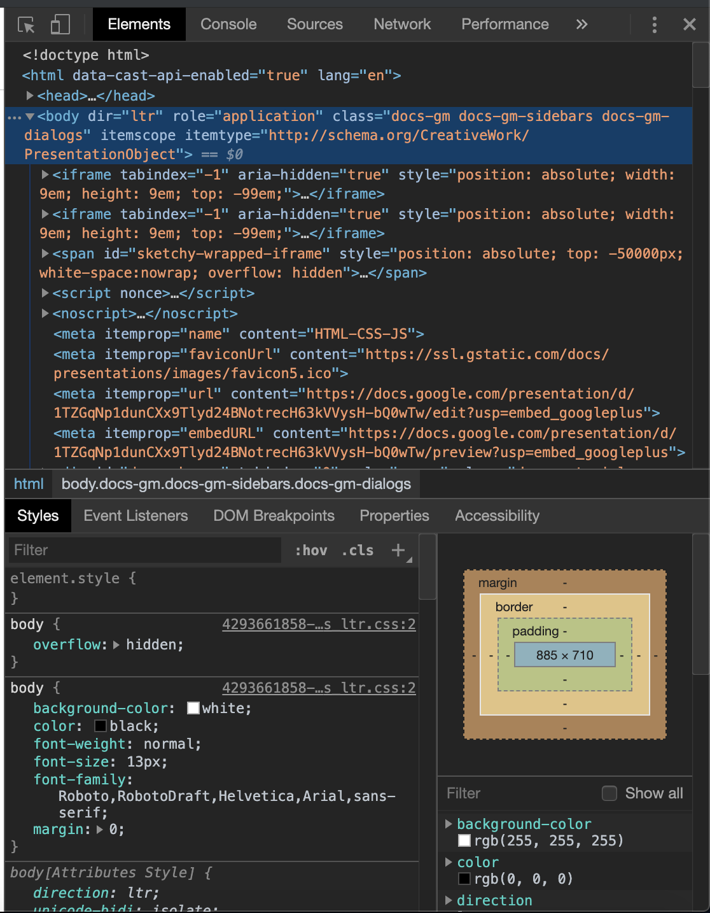
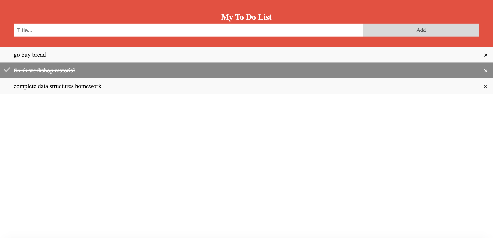

# Basic Web Dev Workshop

This workshop aims to teach how to build a basic website teaching basic concepts of HTML, CSS and Javascript.

## Presentation

For the complete presentation please click [here](https://docs.google.com/presentation/d/1TZGqNp1dunCXx9Tlyd24BNotrecH63kVVysH-bQ0wTw/edit?usp=sharing).

## HTML

- Markup Language
- Easy to use
- Describes the structure of a web page
- Images, video and audio can be added to a web page.
- Hypertext can be added to text.

### Tags

Works using tags to describe its content

```
<h1>
<p>

```

### Closing tags

Most tags need to be closed off for instance

```html
<h1></h1>
<p></p>
```

Some tags on the other hand do not have to be closed

```html
 <input />
```

### Attributes

HTML tags use attributes to give them certain properties

```html
<input type="text" id="myInput" placeholder="Title..." />
```

### Nesting tags

HTML tags can be nested within each other to create complex pages

```html
<html>
  <head>
    <meta name="viewport" content="width=device-width, initial-scale=1" />
    <link rel="stylesheet" href="style.css" />
  <body>
    <div id="myDIV" class="header">
      <h2 style="margin:5px">My To Do List</h2>
      <input type="text" id="myInput" placeholder="Title..." />
      <span onclick="newElement()" class="addBtn">Add</span>
    </div>
    <ul id="myUL"></ul>
    <script src="main.js"></script>
  </body>
</html>

```

### Classes and IDs

- Classes and Ids are special attributes
- They can be used to refer to html tags, from css and javascript( you will get to know in the following sections)

## CSS

- Language used in complement with HTML
- Styles the elements within the web page

### Using CSS in an HTML page

Using an external CSS file

```html
<link rel="stylesheet" href="style.css" />
```

Using a style tag inside the HTML

```html
<style>
  h1 {
    color: blue;
  }
</style>
```

### Styling tags

Use tag or .classname or #id where

- tag

```CSS
ul {
  margin: 0;
  padding: 0;
}
```

- classname

```CSS
.addBtn {
  padding: 10px;
  width: 25%;
  background: #d9d9d9;
  color: #555;
  float: left;
  text-align: center;
  font-size: 16px;
  cursor: pointer;
  transition: 0.3s;
  border-radius: 0;
}
```

- id

```CSS
#submit{
    color:#555;
    float:left;
    text-align:center;
    font-size:16px;
}
```

### Attributes

CSS uses attributes to change the way the property looks

```CSS
  color:blue;
  border:2px;
```

There are several attributes which can be looked at later on, click [here](https://www.w3schools.com/css/css_attribute_selectors.asp) to learn more

## Javascript

- High level programming language
- Initially used very closely with web pages
- Has very good sync with websites
- Easy to learn, dynamic typed language

### Types of JS

- NodeJS
- Vanilla (covered here)

### Using JS in a web page

- writing the javascript inside the html page

```HTML
<script>
    var a = 213*2;
</script>
```

- linking to an external script file

```HTML
<script src="main.js"></script>
```

### Browser console

The browser console is a way to interact with the way the web page renders, there exists a DOM and also a place for you to enter javascript and run it. This is how the console looks.



#### opening the console

Do the following to open up the console

```
Right Click + Inspect
```

### Printing to a console

Javascript uses the following method to print directly to the console

```javascript
console.log("Hello, World");
```

### Declaring variables in javascript

Variables can be declared in javascript in the following manner

```javascript
var a = 5;
let b = "string";
c = 4.52;
```

It can be observed that types need not be indicated while assigning variables, the different keywords used before the variable causes a change to the variable scope. More can be found on this [website](https://www.geeksforgeeks.org/difference-between-var-and-let-in-javascript/).

### Conditional Statements

conditional statements alter the flow of code in any language

```javascript
var a = 5;
if (a > 5) {
  console.log("a is greater than 5");
}
```

#### Logical operators

Javascript uses the following comparison operations

```
< , <= , > , >= , !=
```

#### Relation operators

Javascript uses the following relational operations to combine comparisons

```
and - && , or - || , not - !
```

### Looping

Javascript provides many methods for looping, the two keyword looping mechanisms used to loop through are

#### for loops

```javascript
for (let i = 0; i < 10; i++) {
  console.log(i);
}
```

#### while loops

```javascript
var a = 5;
while (a < 10) {
  console.log(a);
  a++;
}
```

### DOM

- HTML tags, can be referenced in javascript as objects and these objects can be manipulated, changing their properties to change the way the webpage works.
- You can think of the DOM as a tree, in which every nested tag represents a child element

#### creating a referrence to an HTML node

The HTML tag

```HTML
<input id="name-field">
```

Creating an HTML node to refer to the tag

```javascript
var nameFieldNode = document.getElementById("name-field");
```

#### changing properties of the tag

```javascript
nameFieldNode.value = "your name";
```

#### Further notes

- The DOM is a vast subject and many things can be done to change elements, giving you the chance to do anything with a website!
- To learn more about what the DOM can do, and for documentation about all available classes, functions and methods click [here](https://www.w3schools.com)

### External Libraries

With javascript being as vast as it is, people have developed external libaries for javascript and have hosted it over the internet so that anyone can create web applications using these libraries.
This is how you may access a javascript library

```html
<script src="https://code.jquery.com/jquery-3.4.1.min.js"></script>
```

## Hands on Project

This repository contains the code to the hands on project, check each file for explanations of their working

- index.html - contains code the html page
- main.js = contains code for the javascript associated with the html page
- style.css - contains the css for the webpage

### Screenshots


